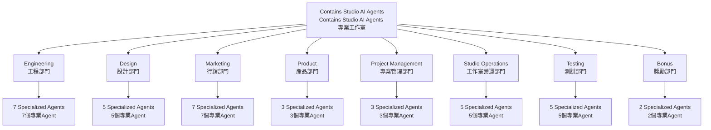
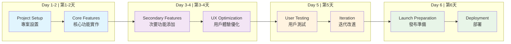
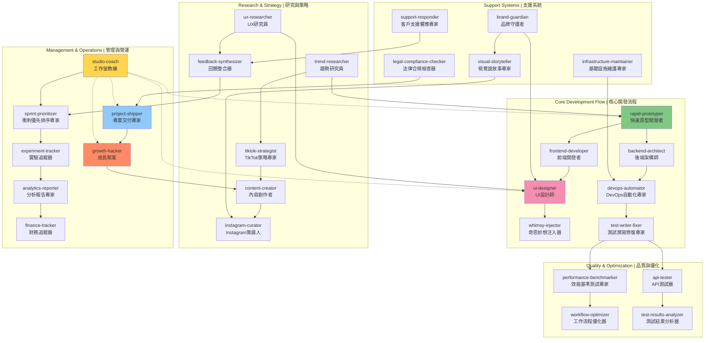

# Contains Studio AI Agents
# Contains Studio AI Agents 專業工作室

A comprehensive collection of specialized AI agents designed to accelerate and enhance every aspect of rapid development. Each agent is an expert in their domain, ready to be invoked when their expertise is needed.

專為快速開發設計的專業 AI agents 完整集合，可加速並增強開發的各個層面。每個 agent 都是各自領域的專家，隨時準備在需要其專業知識時被呼叫。

## Project Structure | 專案結構



## 📥 Installation | 安裝

1. **Download this repository | 下載此儲存庫:**
   ```bash
   git clone https://github.com/contains-studio/agents.git
   ```

2. **Copy to your Claude Code agents directory | 複製到您的 Claude Code agents 目錄:**
   ```bash
   cp -r agents/* ~/.claude/agents/
   ```
   
   Or manually copy all the agent files to your `~/.claude/agents/` directory.
   
   或手動將所有 agent 檔案複製到您的 `~/.claude/agents/` 目錄。

3. **Restart Claude Code | 重啟 Claude Code** to load the new agents. | 以載入新的 agents。

## 🚀 Quick Start | 快速開始

Agents are automatically available in Claude Code. Simply describe your task and the appropriate agent will be triggered. You can also explicitly request an agent by mentioning their name.

Agents 在 Claude Code 中會自動可用。只需描述您的任務，適當的 agent 就會被觸發。您也可以透過提及 agent 名稱來明確請求特定的 agent。

📚 **Learn more | 了解更多:** [Claude Code Sub-Agents Documentation](https://docs.anthropic.com/en/docs/claude-code/sub-agents)

### Example Usage | 使用範例
- "Create a new app for tracking meditation habits" → `rapid-prototyper`
  "建立一個追蹤冥想習慣的新應用程式" → `rapid-prototyper`
- "What's trending on TikTok that we could build?" → `trend-researcher`
  "TikTok 上有什麼趨勢是我們可以打造的？" → `trend-researcher`
- "Our app reviews are dropping, what's wrong?" → `feedback-synthesizer`
  "我們的應用程式評價在下降，有什麼問題？" → `feedback-synthesizer`
- "Make this loading screen more fun" → `whimsy-injector`
  "讓這個載入畫面更有趣" → `whimsy-injector`

## 📁 Directory Structure | 目錄結構

Agents are organized by department for easy discovery:

Agents 按部門組織以便於發現：

```
contains-studio-agents/
├── design/
│   ├── brand-guardian.md
│   ├── ui-designer.md
│   ├── ux-researcher.md
│   ├── visual-storyteller.md
│   └── whimsy-injector.md
├── engineering/
│   ├── ai-engineer.md
│   ├── backend-architect.md
│   ├── devops-automator.md
│   ├── frontend-developer.md
│   ├── mobile-app-builder.md
│   ├── rapid-prototyper.md
│   └── test-writer-fixer.md
├── marketing/
│   ├── app-store-optimizer.md
│   ├── content-creator.md
│   ├── growth-hacker.md
│   ├── instagram-curator.md
│   ├── reddit-community-builder.md
│   ├── tiktok-strategist.md
│   └── twitter-engager.md
├── product/
│   ├── feedback-synthesizer.md
│   ├── sprint-prioritizer.md
│   └── trend-researcher.md
├── project-management/
│   ├── experiment-tracker.md
│   ├── project-shipper.md
│   └── studio-producer.md
├── studio-operations/
│   ├── analytics-reporter.md
│   ├── finance-tracker.md
│   ├── infrastructure-maintainer.md
│   ├── legal-compliance-checker.md
│   └── support-responder.md
├── testing/
│   ├── api-tester.md
│   ├── performance-benchmarker.md
│   ├── test-results-analyzer.md
│   ├── tool-evaluator.md
│   └── workflow-optimizer.md
└── bonus/
    ├── joker.md
    └── studio-coach.md
```

## 📋 Complete Agent List | 完整 Agent 清單

### Engineering Department | 工程部門 (`engineering/`)
- **ai-engineer** - Integrate AI/ML features that actually ship  
  **AI 工程師** - 整合真正能投入使用的 AI/ML 功能
- **backend-architect** - Design scalable APIs and server systems  
  **後端架構師** - 設計可擴展的 API 和伺服器系統
- **devops-automator** - Deploy continuously without breaking things  
  **DevOps 自動化專家** - 持續部署而不破壞系統
- **frontend-developer** - Build blazing-fast user interfaces  
  **前端開發者** - 建構超快速的使用者介面
- **mobile-app-builder** - Create native iOS/Android experiences  
  **行動應用程式建構師** - 創建原生 iOS/Android 體驗
- **rapid-prototyper** - Build MVPs in days, not weeks  
  **快速原型開發者** - 以天為單位而非週來建構 MVP
- **test-writer-fixer** - Write tests that catch real bugs  
  **測試撰寫修復專家** - 撰寫能捕捉真實錯誤的測試

### Product Department | 產品部門 (`product/`)
- **feedback-synthesizer** - Transform complaints into features  
  **回饋整合器** - 將抱怨轉化為功能
- **sprint-prioritizer** - Ship maximum value in 6 days  
  **衝刺優先排序專家** - 在 6 天內交付最大價值
- **trend-researcher** - Identify viral opportunities  
  **趋勢研究員** - 識別病毒式傳播機會

### Marketing Department | 行銷部門 (`marketing/`)
- **app-store-optimizer** - Dominate app store search results  
  **應用商店優化專家** - 主導應用商店搜尋結果
- **content-creator** - Generate content across all platforms  
  **內容創作者** - 跨平台生成內容
- **growth-hacker** - Find and exploit viral growth loops  
  **成長駭客** - 發現並利用病毒式成長循環
- **instagram-curator** - Master the visual content game  
  **Instagram 策展人** - 掌握視覺內容遊戲
- **reddit-community-builder** - Win Reddit without being banned  
  **Reddit 社群建構師** - 在不被封禁的情況下贏得 Reddit
- **tiktok-strategist** - Create shareable marketing moments  
  **TikTok 策略專家** - 創造可分享的行銷時刻
- **twitter-engager** - Ride trends to viral engagement  
  **Twitter 互動專家** - 乘著趨勢達到病毒式互動

### Design Department | 設計部門 (`design/`)
- **brand-guardian** - Keep visual identity consistent everywhere  
  **品牌守護者** - 在各處保持視覺識別的一致性
- **ui-designer** - Design interfaces developers can actually build  
  **UI 設計師** - 設計開發者真正能建構的介面
- **ux-researcher** - Turn user insights into product improvements  
  **UX 研究員** - 將使用者洞察轉化為產品改進
- **visual-storyteller** - Create visuals that convert and share  
  **視覺說故事專家** - 創造能轉換和分享的視覺內容
- **whimsy-injector** - Add delight to every interaction  
  **奇思妙想注入器** - 為每個互動增添愉悅感

### Project Management | 專案管理部門 (`project-management/`)
- **experiment-tracker** - Data-driven feature validation  
  **實驗追蹤器** - 數據驅動的功能驗證
- **project-shipper** - Launch products that don't crash  
  **產品交付專家** - 推出不會崩潰的產品
- **studio-producer** - Keep teams shipping, not meeting  
  **工作室製作人** - 讓團隊專注於交付而不是開會

### Studio Operations | 工作室營運部門 (`studio-operations/`)
- **analytics-reporter** - Turn data into actionable insights  
  **分析報告專家** - 將數據轉化為可行的洞察
- **finance-tracker** - Keep the studio profitable  
  **財務追蹤器** - 保持工作室盈利
- **infrastructure-maintainer** - Scale without breaking the bank  
  **基礎設施維護專家** - 在不破產的情況下擴展
- **legal-compliance-checker** - Stay legal while moving fast  
  **法律合規檢查器** - 在快速行動時保持合法
- **support-responder** - Turn angry users into advocates  
  **客戶支援響應專家** - 將憤怒的使用者轉化為擁護者

### Testing & Benchmarking | 測試與基準測試部門 (`testing/`)
- **api-tester** - Ensure APIs work under pressure  
  **API 測試器** - 確保 API 在壓力下能正常工作
- **performance-benchmarker** - Make everything faster  
  **效能基準測試專家** - 讓一切都更快速
- **test-results-analyzer** - Find patterns in test failures  
  **測試結果分析器** - 在測試失敗中找出模式
- **tool-evaluator** - Choose tools that actually help  
  **工具評估器** - 選擇真正有幫助的工具
- **workflow-optimizer** - Eliminate workflow bottlenecks  
  **工作流程優化器** - 消除工作流程瓶頸

## 🎁 Bonus Agents | 獎勵 Agents
- **studio-coach** - Rally the AI troops to excellence  
  **工作室教練** - 號召 AI 團隊追求卓越
- **joker** - Lighten the mood with tech humor  
  **開心果** - 用科技幽默輕鬆氣氛

## 🎯 Proactive Agents | 主動觸發的 Agents

Some agents trigger automatically in specific contexts:

某些 agents 在特定情境下會自動觸發：

- **studio-coach** - When complex multi-agent tasks begin or agents need guidance  
  **工作室教練** - 當複雜的多 agent 任務開始或 agents 需要指導時
- **test-writer-fixer** - After implementing features, fixing bugs, or modifying code  
  **測試撰寫修復專家** - 在實作功能、修復錯誤或修改程式碼後
- **whimsy-injector** - After UI/UX changes  
  **奇思妙想注入器** - 在 UI/UX 變更後
- **experiment-tracker** - When feature flags are added  
  **實驗追蹤器** - 當添加功能標誌時

## 💡 Best Practices | 最佳實務

1. **Let agents work together** - Many tasks benefit from multiple agents  
   **讓 agents 協同工作** - 許多任務受益於多個 agents
2. **Be specific** - Clear task descriptions help agents perform better  
   **明確描述** - 清晰的任務描述幫助 agents 表現更佳
3. **Trust the expertise** - Agents are designed for their specific domains  
   **信任專業知識** - Agents 專為其特定領域設計
4. **Iterate quickly** - Agents support the 6-day sprint philosophy  
   **快速迭代** - Agents 支持 6 天衝刺哲學

## 📈 6-Day Sprint Workflow | 6天衝刺工作流程



## 🤝 Agent Collaboration Network | Agent 協作網絡



## 🔧 Technical Details | 技術細節

### Agent Structure | Agent 結構
Each agent includes: | 每個 agent 包含：
- **name**: Unique identifier | **名稱**：唯一識別符
- **description**: When to use the agent with examples | **描述**：使用時機與範例
- **color**: Visual identification | **顏色**：視覺識別
- **tools**: Specific tools the agent can access | **工具**：agent 可使用的特定工具
- **System prompt**: Detailed expertise and instructions | **系統提示**：詳細的專業知識和指令

### Adding New Agents | 添加新的 Agents
1. Create a new `.md` file in the appropriate department folder  
   在適當的部門資料夾中建立新的 `.md` 檔案
2. Follow the existing format with YAML frontmatter  
   遵循現有的 YAML frontmatter 格式
3. Include 3-4 detailed usage examples  
   包含 3-4 個詳細的使用範例
4. Write comprehensive system prompt (500+ words)  
   撰寫全面的系統提示（500+ 字）
5. Test the agent with real tasks  
   用真實任務測試 agent

## 📊 Agent Performance | Agent 效能

Track agent effectiveness through: | 透過以下指標追蹤 agent 效果：
- Task completion time | 任務完成時間
- User satisfaction | 用戶滿意度  
- Error rates | 錯誤率
- Feature adoption | 功能採用率
- Development velocity | 開發速度

## 🚦 Status | 狀態

- ✅ **Active | 活躍**: Fully functional and tested | 功能完整且已測試
- 🚧 **Coming Soon | 即將推出**: In development | 開發中
- 🧪 **Beta | 測試版**: Testing with limited functionality | 有限功能測試中

## 🛠️ Customizing Agents for Your Studio

### Agent Customization Todo List

Use this checklist when creating or modifying agents for your specific needs:

#### 📋 Required Components
- [ ] **YAML Frontmatter**
  - [ ] `name`: Unique agent identifier (kebab-case)
  - [ ] `description`: When to use + 3-4 detailed examples with context/commentary
  - [ ] `color`: Visual identification (e.g., blue, green, purple, indigo)
  - [ ] `tools`: Specific tools the agent can access (Write, Read, MultiEdit, Bash, etc.)

#### 📝 System Prompt Requirements (500+ words)
- [ ] **Agent Identity**: Clear role definition and expertise area
- [ ] **Core Responsibilities**: 5-8 specific primary duties
- [ ] **Domain Expertise**: Technical skills and knowledge areas
- [ ] **Studio Integration**: How agent fits into 6-day sprint workflow
- [ ] **Best Practices**: Specific methodologies and approaches
- [ ] **Constraints**: What the agent should/shouldn't do
- [ ] **Success Metrics**: How to measure agent effectiveness

#### 🎯 Required Examples by Agent Type

**Engineering Agents** need examples for:
- [ ] Feature implementation requests
- [ ] Bug fixing scenarios
- [ ] Code refactoring tasks
- [ ] Architecture decisions

**Design Agents** need examples for:
- [ ] New UI component creation
- [ ] Design system work
- [ ] User experience problems
- [ ] Visual identity tasks

**Marketing Agents** need examples for:
- [ ] Campaign creation requests
- [ ] Platform-specific content needs
- [ ] Growth opportunity identification
- [ ] Brand positioning tasks

**Product Agents** need examples for:
- [ ] Feature prioritization decisions
- [ ] User feedback analysis
- [ ] Market research requests
- [ ] Strategic planning needs

**Operations Agents** need examples for:
- [ ] Process optimization
- [ ] Tool evaluation
- [ ] Resource management
- [ ] Performance analysis

#### ✅ Testing & Validation Checklist
- [ ] **Trigger Testing**: Agent activates correctly for intended use cases
- [ ] **Tool Access**: Agent can use all specified tools properly
- [ ] **Output Quality**: Responses are helpful and actionable
- [ ] **Edge Cases**: Agent handles unexpected or complex scenarios
- [ ] **Integration**: Works well with other agents in multi-agent workflows
- [ ] **Performance**: Completes tasks within reasonable timeframes
- [ ] **Documentation**: Examples accurately reflect real usage patterns

#### 🔧 Agent File Structure Template

```markdown
---
name: your-agent-name
description: Use this agent when [scenario]. This agent specializes in [expertise]. Examples:\n\n<example>\nContext: [situation]\nuser: "[user request]"\nassistant: "[response approach]"\n<commentary>\n[why this example matters]\n</commentary>\n</example>\n\n[3 more examples...]
color: agent-color
tools: Tool1, Tool2, Tool3
---

You are a [role] who [primary function]. Your expertise spans [domains]. You understand that in 6-day sprints, [sprint constraint], so you [approach].

Your primary responsibilities:
1. [Responsibility 1]
2. [Responsibility 2]
...

[Detailed system prompt content...]

Your goal is to [ultimate objective]. You [key behavior traits]. Remember: [key philosophy for 6-day sprints].
```

#### 📂 Department-Specific Guidelines | 部門專屬指導原則

**Engineering** (`engineering/`): Focus on implementation speed, code quality, testing  
**工程部門**：專注於實作速度、程式碼品質、測試

**Design** (`design/`): Emphasize user experience, visual consistency, rapid iteration  
**設計部門**：強調用戶體驗、視覺一致性、快速迭代

**Marketing** (`marketing/`): Target viral potential, platform expertise, growth metrics  
**行銷部門**：目標病毒傳播潛力、平台專業知識、成長指標

**Product** (`product/`): Prioritize user value, data-driven decisions, market fit  
**產品部門**：優先考慮用戶價值、數據驅動決策、市場適配

**Operations** (`studio-operations/`): Optimize processes, reduce friction, scale systems  
**營運部門**：優化流程、減少摩擦、擴展系統

**Testing** (`testing/`): Ensure quality, find bottlenecks, validate performance  
**測試部門**：確保品質、發現瓶頸、驗證效能

**Project Management** (`project-management/`): Coordinate teams, ship on time, manage scope  
**專案管理部門**：協調團隊、準時交付、管理範圍

#### 🎨 Customizations | 客製化

Modify these elements for your needs: | 根據您的需求修改這些元素：
- [ ] Adjust examples to reflect your product types  
      調整範例以反映您的產品類型
- [ ] Add specific tools agents have access to  
      添加 agents 可使用的特定工具
- [ ] Modify success metrics for your KPIs  
      修改成功指標以符合您的 KPI
- [ ] Update department structure if needed  
      如需要可更新部門結構
- [ ] Customize agent colors for your brand  
      客製化 agent 顏色以符合品牌

## 🤝 Contributing | 貢獻

To improve existing agents or suggest new ones: | 改進現有 agents 或建議新的 agents：
1. Use the customization checklist above  
   使用上面的客製化檢查清單
2. Test thoroughly with real projects  
   用真實專案進行全面測試
3. Document performance improvements  
   記錄效能改進
4. Share successful patterns with the community  
   與社群分享成功的模式
